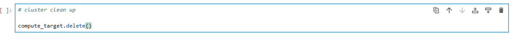

# Optimizing an ML Pipeline in Azure

## Overview

This project is part of the Udacity Azure ML Nanodegree program. In this project, I focused on creating and improving an Azure ML pipeline using the Python SDK and a custom Scikit-learn Logistic Regression model. I started by optimizing the model's hyperparameters with HyperDrive. Next, I used Azure AutoML to find the best-performing model for the same dataset. Finally, I compared the results from both methods to assess their performance and measure their effectiveness.

## Summary

### Problem Statement

The objective of this project is to predict whether a customer will subscribe to a term deposit based on data from a direct marketing campaign conducted by a bank.
 The problem is framed as a classification task with two possible outcomes: "yes" (the customer subscribes) or "no" (the customer does not subscribe). 
 This task emphasizes customer acquisition by targeting potential subscribers. By accurately predicting subscription likelihood, the model can help the bank improve 
 its marketing strategy and optimize resource allocation.

### Results

The best-performing model using HyperDrive was a Logistic Regression with a regularization strength of 1.0 and 150 maximum iterations, achieving an accuracy of 0.917 and an AUC_weighted of 0.932. In comparison, the AutoML model achieved significantly better results, with an AUC_weighted of 0.950 and a range of other metrics indicating superior performance. Given that AUC_weighted was our main metric, the AutoML model proved to be the better choice.

The AutoML model performed better overall, with LightGBM being identified as the best model. It achieved an AUC_weighted of 0.950, surpassing the Logistic Regression model from HyperDrive, which had an AUC_weighted of 0.932. This makes AutoML's LightGBM the superior model for this task based on our primary metric, AUC_weighted.

## Scikit-learn Pipeline

### Pipeline architecture

The pipeline starts with a data preprocessing step, where categorical variables are one-hot encoded, numerical mappings are applied, and the target variable is binarized, preparing the dataset for training. Hyperparameter tuning is conducted using Azure HyperDrive with a Logistic Regression model from Scikit-learn, optimizing parameters such as C (regularization strength) and max_iter (iterations) to maximize the AUC_weighted metric, while a Bandit policy ensures efficient early stopping of underperforming runs.

**What are the benefits of the parameter sampler you chose?**

The RandomParameterSampler is efficient because it explores a large hyperparameter space by randomly selecting combinations, which can uncover good configurations without the exhaustive effort of testing all possibilities. This approach is especially useful when the parameter space is large, as it saves time and computational resources compared to grid search.

**What are the benefits of the early stopping policy you chose?**

The BanditPolicy saves time and resources by stopping poorly performing runs early, allowing the experiment to focus on the most promising hyperparameter configurations.

## AutoML

The AutoML model generated is a classification model optimized for the primary metric AUC_weighted, which is chosen because it evaluates the model's ability to distinguish between classes while handling imbalanced datasets effectively by weighting the AUC for each class by its prevalence. The model performs automatic feature engineering (featurization='auto'), includes model explainability, and uses 5-fold cross-validation for robust evaluation. Additionally, early stopping is enabled to avoid overfitting, and the configuration supports ONNX-compatible models, with voting ensembles included to improve overall performance.

## Pipeline comparison

**Compare the two models and their performance. What are the differences in accuracy? In architecture? If there was a difference, why do you think there was one?**

The two models differ in both architecture and performance. The Logistic Regression model from HyperDrive achieved an accuracy of 0.917 and an AUC_weighted of 0.932, while the LightGBM model from AutoML achieved an accuracy of 0.915 and a significantly better AUC_weighted of 0.950. The performance difference likely stems from the architectures: Logistic Regression is a linear model, which may struggle with complex relationships in the data, while LightGBM is a tree-based ensemble model, better suited for capturing non-linear patterns and interactions. The advanced feature engineering and model selection techniques in AutoML further contributed to its superior performance.

## Future work

**What are some areas of improvement for future experiments? Why might these improvements help the model?**

Expanding the search space for hyperparameters allows the model to explore a wider range of configurations, increasing the chances of finding more optimal settings that improve performance. Balancing the dataset by oversampling or generating synthetic data ensures the model is not biased toward majority classes, leading to better predictions for underrepresented outcomes. Additionally, experimenting with advanced models like neural networks can capture complex, non-linear relationships in the data, potentially improving accuracy and overall performance.

## Proof of cluster clean up

**If you did not delete your compute cluster in the code, please complete this section. Otherwise, delete this section.**
**Image of cluster marked for deletion**

